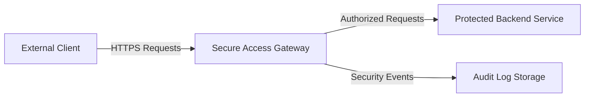
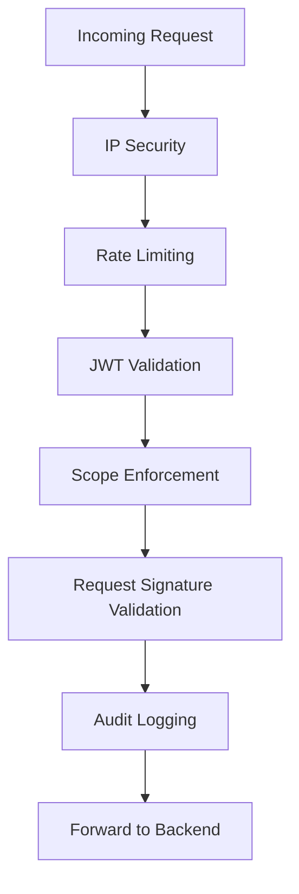

# Secure Access Gateway (SAG)

A **security-first API gateway** designed to enforce Zero Trust access controls in front of backend services.

This project focuses on **authentication validation, authorization enforcement, abuse prevention, request integrity, and auditability**.  
It is intentionally designed as a **policy enforcement point**, not an identity provider.

---

## Project Status

✅ Repository scaffolding complete  
✅ Threat model documented  
✅ Architecture documented  
✅ OpenAPI specification defined  
🚧 Implementation pending

No application code has been written yet.

---

## Project Goals

- Enforce JWT-based access validation
- Apply scope-based authorization per endpoint
- Prevent abuse via rate limiting and IP filtering
- Detect and block replayed or tampered requests
- Provide security-grade audit logs for every decision
- Centralize security logic outside of backend services

---

## What This Project Is

- A **Zero Trust access gateway**
- A **security policy enforcement layer**
- A **defense-in-depth architecture showcase**
- A **cybersecurity-focused portfolio project**

---

## What This Project Is Not

- An OAuth provider
- A user authentication system
- A production-ready gateway
- A cloud-managed security service

---

## High-Level Architecture



All trust transitions occur at the gateway.

---

## Request Lifecycle



Requests failing at any stage are rejected immediately and logged.

---

## Security Controls

### Authentication Validation
- Requires a valid **Bearer JWT** on protected endpoints
- Verifies token signature, issuer, audience, and expiration
- Tokens are validated only (not issued) by the gateway

**Mitigates:** unauthorized access, token forgery

---

### Authorization (Scope Enforcement)
- Each endpoint requires explicit scopes
- Missing scopes result in immediate denial
- Authorization is enforced centrally

**Mitigates:** privilege escalation, over-broad access

---

### Rate Limiting
- Enforced per IP and per token subject
- Sliding window rate limiting model
- Violations return `429 Too Many Requests`

**Mitigates:** brute force attacks, API scraping

---

### IP Filtering
- Explicit allowlists and denylists
- Deny rules override allow rules
- Executed early in request processing

**Mitigates:** known malicious sources

---

### Request Integrity & Replay Protection
- Optional HMAC-based request signatures
- Timestamp validation to prevent replays
- Requests outside allowed window are rejected

**Mitigates:** replay attacks, request tampering

---

### Audit Logging
- Every request is logged with:
  - Timestamp
  - Source IP
  - Endpoint
  - Decision (ALLOW / DENY)
  - Reason for decision
- Logs are append-only

**Mitigates:** undetected abuse, insider misuse

---

### Secure Failure Handling
- Explicit failure responses
- No sensitive data in error messages
- Common responses:
  - `401 Unauthorized`
  - `403 Forbidden`
  - `429 Too Many Requests`

---

## Threat Model

Threats are documented in detail in [`docs/threat-model.md`](docs/threat-model.md).

Key threat categories:
- Unauthorized access
- Privilege escalation
- Token replay
- API abuse
- Insider misuse

---

## OpenAPI Specification

The full OpenAPI 3.0.3 specification is available at:

```
openapi/gateway.yaml
```

It defines:
- Security schemes
- Required authorization scopes
- Error response models

---

## Repository Structure

```
secure-access-gateway/
├── .github/
│   └── workflows/
├── docker/
├── docs/
│   ├── architecture.md
│   └── threat-model.md
├── openapi/
│   └── gateway.yaml
├── src/
├── README.md
└── .gitignore
```

---

## Design Principles

- Zero Trust by default
- Least privilege enforcement
- Explicit deny behavior
- Centralized security logic
- Observability over opacity

---

## Future Enhancements

- Mutual TLS (mTLS) between gateway and backend
- External SIEM integration
- Distributed rate limiting
- Multi-tenant policy enforcement
- Admin security dashboard

---

## License

MIT License

---

## Summary

The Secure Access Gateway demonstrates how **modern API security controls** can be implemented cleanly and intentionally without coupling security logic to application code.

This project is designed to showcase **security architecture, threat modeling, and defensive system design** rather than feature completeness.
