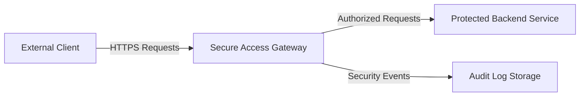
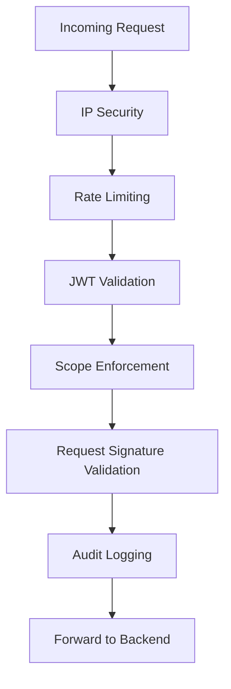
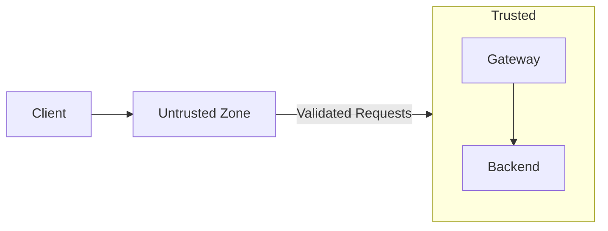
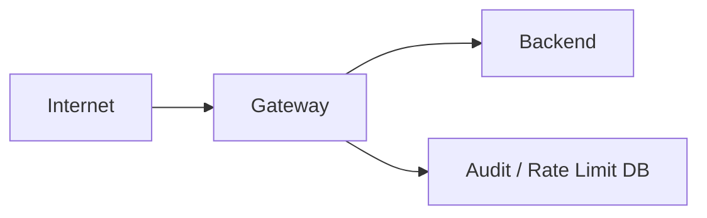

# Architecture — Secure Access Gateway (SAG)

This document describes the high-level architecture of the Secure Access Gateway (SAG), its components, and how requests flow through the system.

The architecture is intentionally **security-first**, enforcing Zero Trust principles and defense-in-depth at every layer.

---

## Architectural Goals

- Enforce access controls before requests reach backend services
- Minimize trust between system components
- Fail securely and explicitly
- Provide strong auditability and observability
- Remain simple, modular, and extensible

---

## High-Level System Overview

---

## Core Components

### 1. External Clients
Untrusted entities making HTTP requests to protected APIs.

Characteristics:
- May be malicious or compromised
- Possess bearer tokens and request signatures
- Communicate only over HTTPS

---

### 2. Secure Access Gateway
The central enforcement point for all security controls.

Responsibilities:
- Token validation
- Authorization enforcement
- Abuse prevention
- Request integrity verification
- Audit logging

The gateway is the **only** component exposed to the public network.

---

### 3. Protected Backend Services
Internal services that trust the gateway for access control.

Characteristics:
- Not directly exposed to the internet
- Do not perform authentication or authorization
- Assume requests are pre-validated

---

### 4. Audit Log Storage
Persistent storage for security-relevant events.

Stored data includes:
- Timestamp
- Source IP
- Endpoint accessed
- Decision (ALLOW / DENY)
- Reason for decision

Audit logs are append-only and designed for forensic analysis.

---

## Request Processing Pipeline

Requests pass through a fixed sequence of middleware components.

---

## Middleware Responsibilities

### IP Security
- Enforces allowlists and denylists
- Blocks known malicious sources early

### Rate Limiting
- Limits request frequency per IP and token
- Mitigates brute force and abuse attempts

### JWT Validation
- Verifies signature integrity
- Enforces issuer, audience, and expiration

### Scope Enforcement
- Maps endpoints to required scopes
- Enforces least privilege access

### Request Signature Validation
- Validates request integrity
- Prevents replay attacks using timestamps

### Audit Logging
- Records all decisions
- Executes regardless of allow or deny outcome

---

## Trust Boundaries

- All trust transitions occur at the gateway
- Backend services do not trust clients directly

---

## Failure Modes

The gateway is designed to fail securely.

| Condition | Result |
|---------|--------|
| Missing token | 401 Unauthorized |
| Invalid signature | 401 Unauthorized |
| Missing scope | 403 Forbidden |
| IP blocked | 403 Forbidden |
| Rate limit exceeded | 429 Too Many Requests |
| Internal error | 500 Internal Server Error |

Failures are logged for later review.

---

## Deployment Model

- Gateway deployed as a containerized service
- Backend services deployed on private network
- Database isolated from public access

---

## Extensibility

The architecture supports future enhancements such as:
- mTLS between gateway and backend
- External SIEM integration
- Distributed rate limiting
- Multi-region deployments

---

## Summary

This architecture ensures that:
- Security decisions are centralized
- Backend services remain simple and protected
- All access is explicit, logged, and enforceable
- The system remains understandable and auditable

The Secure Access Gateway acts as a **policy enforcement point**, not an identity provider or application server.
