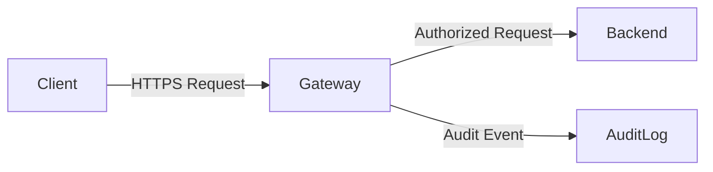
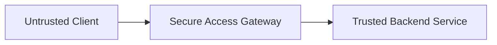
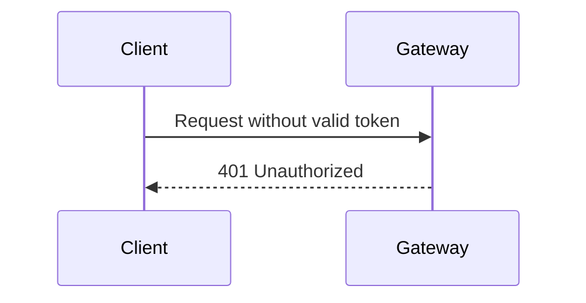
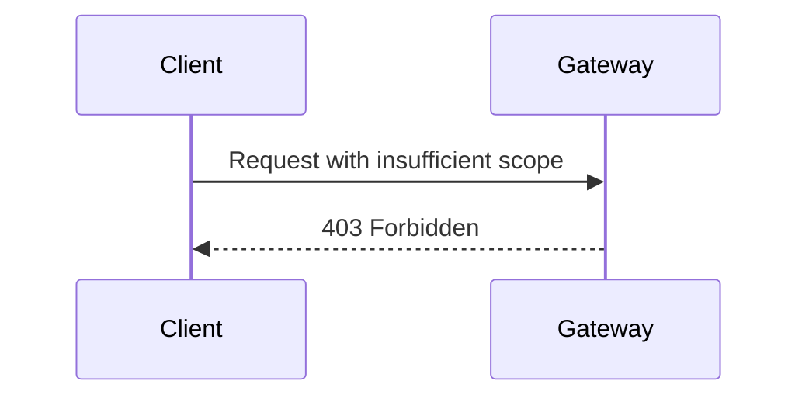
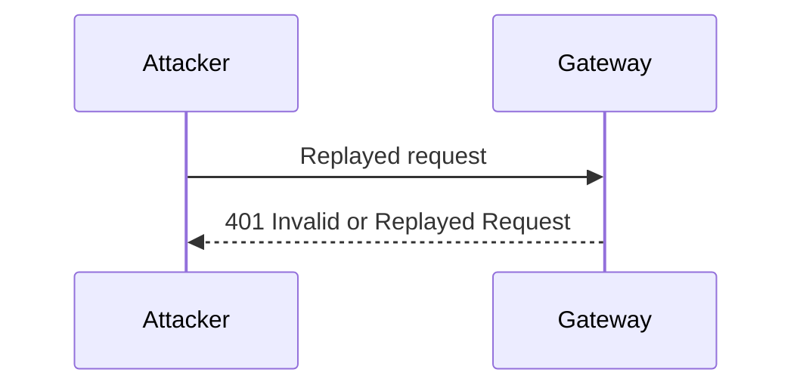
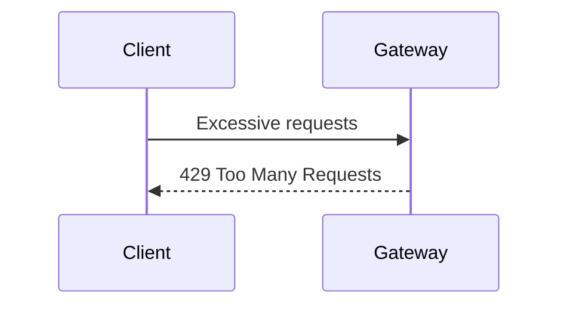

# Threat Model — Secure Access Gateway (SAG)

This document describes the security threats considered during the design of the Secure Access Gateway (SAG) and the controls implemented to mitigate them.

The gateway follows **Zero Trust principles**: no client, request, or token is trusted by default.

---

## Scope

This threat model applies to:
- External clients sending HTTP requests
- The Secure Access Gateway itself
- Downstream backend services protected by the gateway

This model **does not** cover:
- Identity provider internals
- OAuth token issuance
- End-user credential storage

---

## Assumptions

- All inbound traffic is untrusted
- Backend services trust the gateway exclusively
- Tokens may be intercepted, replayed, or tampered with
- Attackers may have partial knowledge of API structure
- The gateway is publicly accessible over HTTPS

---

## High-Level Data Flow

---

## Assets

| Asset | Description |
|-----|------------|
| API endpoints | Protected backend functionality |
| JWT tokens | Proof of authorization |
| Scopes | Authorization boundaries |
| Audit logs | Security event records |
| Rate-limit state | Abuse detection data |

---

## Trust Boundaries

- Clients operate **outside** the trust boundary
- Backend services operate **inside** the trust boundary
- The gateway enforces all transitions

---

## Threat Categories

Threats were identified using a STRIDE-inspired analysis.

---

### 1. Unauthorized Access

**Threat:**  
An attacker attempts to access protected endpoints without a valid token.

**Attack Vectors:**
- Missing Authorization header
- Expired token
- Forged token

**Mitigations:**
- JWT signature validation
- Token expiration enforcement
- Strict issuer and audience checks

---

### 2. Privilege Escalation

**Threat:**  
A client attempts to access an endpoint requiring higher privileges.

**Attack Vectors:**
- Missing required scope
- Scope manipulation in token payload

**Mitigations:**
- Scope-to-route enforcement
- Immutable JWT claims
- Deny-by-default policy

---

### 3. Token Replay Attacks

**Threat:**  
A captured token or request is replayed to perform unauthorized actions.

**Attack Vectors:**
- Stolen bearer tokens
- Replayed signed requests

**Mitigations:**
- Short-lived tokens
- Timestamp validation
- Request signature verification
- Replay window enforcement

---

### 4. API Abuse & Brute Force

**Threat:**  
An attacker floods the gateway to enumerate or overwhelm endpoints.

**Attack Vectors:**
- High-frequency requests
- Distributed requests from multiple IPs

**Mitigations:**
- Per-IP rate limiting
- Per-token rate limiting
- Sliding time window counters

---

### 5. Tampering & Message Integrity

**Threat:**  
Requests are modified in transit to alter intent or payload.

**Attack Vectors:**
- Modified request bodies
- Header injection

**Mitigations:**
- HTTPS enforcement
- HMAC request signatures
- Body hash verification

---

### 6. Insider Misuse

**Threat:**  
Authorized clients misuse access beyond intended behavior.

**Attack Vectors:**
- Excessive request patterns
- Access outside normal usage windows

**Mitigations:**
- Comprehensive audit logging
- Behavioral monitoring
- Manual review capability

---

## Audit & Logging Strategy

All requests are logged with:
- Timestamp
- Source IP
- Endpoint
- Decision (ALLOW / DENY)
- Reason code

Audit logs are append-only and designed for forensic review.

---

## Residual Risk

The following risks remain and are accepted for this project:
- Credential compromise at the client
- Distributed denial-of-service attacks beyond gateway capacity

These risks would require external infrastructure in a production system.

---

## Summary

This threat model ensures that the Secure Access Gateway:
- Fails securely
- Enforces least privilege
- Detects and blocks abuse
- Provides security-grade observability
